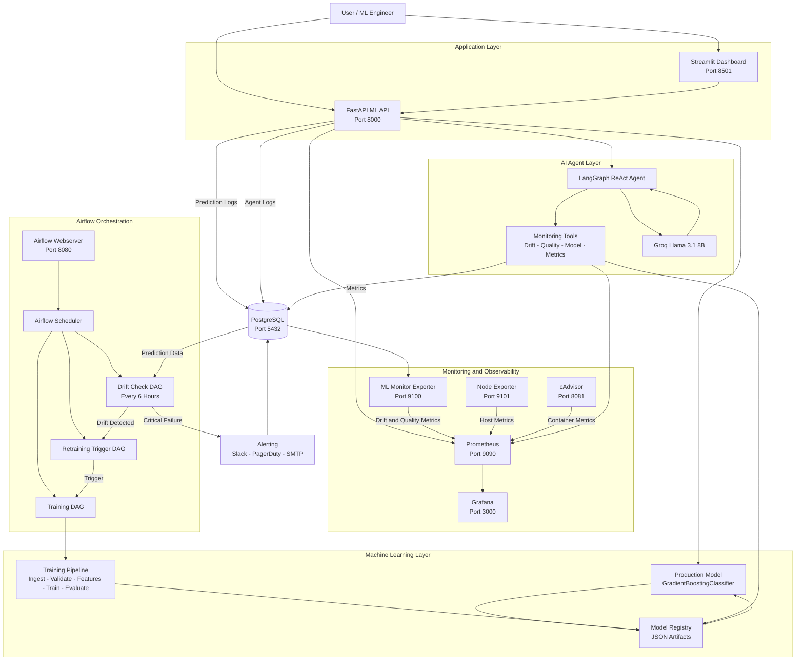

# SentinelML — Production ML Monitoring & Auto-Retraining System

> End-to-end MLOps infrastructure: real-time drift detection, automated retraining pipelines, observability dashboards, and a natural-language agent interface — all running in a single `docker compose up`.

<!-- INSERT: System architecture diagram here -->

---

## Overview

SentinelML is a production-grade ML monitoring system built to demonstrate the full operational lifecycle of a deployed machine learning model. It serves a GradientBoosting classifier trained on the UCI Adult Income dataset, logs every prediction to PostgreSQL, detects statistical data drift using KS-test, chi-squared, and PSI, automatically triggers retraining via Apache Airflow when drift exceeds thresholds, and exposes the entire system state through a natural-language conversational agent.

The project is intentionally built without managed ML platforms — no MLflow, no Evidently AI, no prometheus-client library. Every component is implemented from first principles to demonstrate deep understanding of the underlying mechanisms.

**Model performance:** 86.41% validation accuracy · 0.9212 ROC-AUC · 30,162 training samples · < 20ms p50 inference latency

---

## Architecture

## Architecture

The system runs as a containerized ML platform with separate services for inference, training, monitoring, orchestration, and observability.



### Core ML Lifecycle

```text
Data
  |
  v
Training Pipeline
  |
  v
Model Evaluation
  |
  v
Model Registry
  |
  v
FastAPI Inference
  |
  v
Prediction Logs
  |
  v
Drift Detection
  |
  +---- No Drift ----> Continue Serving
  |
  +---- Drift -------> Retraining
                         |
                         v
                    New Model
                         |
                         v
                   Model Registry
```

## Quick Start

The system runs as 9 Docker services connected on a shared bridge network:

| Service | Port | Role |
|---|---|---|
| `ml_api` | 8000 / 9100 | FastAPI inference + Prometheus exporter |
| `ml_postgres` | 5432 | Prediction logs, drift reports, model registry |
| `ml_prometheus` | 9090 | Metrics scraping and storage |
| `ml_grafana` | 3000 | Observability dashboards |
| `airflow_webserver` | 8080 | DAG management UI |
| `airflow_scheduler` | — | Cron-based pipeline orchestration |
| `ml_node_exporter` | 9101 | Host-level system metrics |
| `ml_cadvisor` | 8081 | Container-level resource metrics |
| `streamlit` | 8501 | Control panel and agent chat UI |

### Request Flow

```
POST /predict
    → Pydantic v2 schema validation (14 features, enum constraints, cross-field rules)
    → FeaturePipeline.transform() — same fitted pipeline as training
    → GBM.predict() → confidence, class probabilities
    → Async write to PostgreSQL (JSONL fallback if DB unavailable)
    → In-memory Prometheus counter update
    → Response: prediction, confidence, latency, model version
```

### Drift Detection Loop

```
airflow_scheduler (every 6h)
    → drift_check_dag: fetch last 6h of prediction_logs from PostgreSQL
    → KS-test (numerical features) + chi-squared (categorical) + PSI (all features)
    → If overall_drifted: set Airflow Variable drift_retrain_triggered=True
    → (30 min later) retrain_trigger_dag: check variable + cooldown window
    → If triggered: fire TriggerDagRunOperator on ml_training_pipeline
    → ingest → validate → build_features → train → evaluate → register
    → New model promoted if accuracy > 0.75 and ROC-AUC > 0.75
    → API picks up new model on next request via file mtime check (zero-downtime reload)
```

---

## Key Design Decisions

### Custom JSON Model Registry (not MLflow)
The production model is tracked via a single JSON file at `artifacts/production_model.json`. Training writes it, the API reads it, and hot-reloading is triggered by file mtime comparison on every request. MLflow's operational overhead (tracking server, separate DB, UI) is not justified for a single-model deployment. The JSON registry provides the same guarantees — versioning, promotion, rollback — with zero extra infrastructure.

### Raw SciPy Drift Detection (not Evidently AI)
Drift detection uses `scipy.stats` directly: KS-test for numerical features, chi-squared for categorical, PSI for overall stability. Thresholds are PSI > 0.1 (warning) and PSI > 0.2 (critical), KS/chi-squared p-value < 0.05. These are the industry-standard thresholds with well-understood statistical semantics. Using a library abstraction would obscure the mechanism that needs to be explained and defended.

### Dual-Sink Prediction Logging
Every prediction is written asynchronously to PostgreSQL. If the DB is unreachable, the logger falls back to a JSONL file on disk — no prediction request ever fails due to a logging error. The API never blocks on DB writes.

### Airflow Docker Isolation
Airflow 2.9.1 requires SQLAlchemy < 2.0. The rest of the project uses SQLAlchemy 2.x. Rather than pin the whole project to an older version, Airflow runs in a completely isolated container built from the official `apache/airflow:2.9.1-python3.11` image. The DAG code accesses the project source via a mounted PYTHONPATH. This is the correct production pattern for managing dependency conflicts in a microservice architecture.

### stdlib urllib Only (no requests library)
The alerting module sends Slack webhooks, PagerDuty events, and SMTP email using only Python's standard library. This eliminates a runtime dependency, reduces the attack surface, and demonstrates that external HTTP calls do not require a third-party library for straightforward use cases.

### Agent Tools via Direct Imports (no HTTP self-calls)
The LangGraph agent tools read system state via direct file reads and in-process Python imports rather than HTTP calls back to the API. A tool calling `localhost:8000` from inside the same container that serves that endpoint creates a deadlock — the worker thread handling the agent request cannot serve its own sub-request. Direct imports resolve this entirely and reduce latency by ~400ms.

---

## Monitoring Stack

### Metrics (two scrape targets)

**`ml_api_*` prefix** — exported by FastAPI at `:8000/metrics`
- `ml_api_requests_total` — total inference requests
- `ml_api_errors_total` — failed requests
- `ml_api_latency_ms_bucket` — full latency histogram (p50, p95, p99)
- `ml_api_confidence_bucket` — prediction confidence distribution
- `ml_api_predictions_class_0_total` / `ml_api_predictions_class_1_total`
- `ml_api_requests_by_version_total{model_version="..."}` — per-version traffic

**`ml_monitor_*` prefix** — exported by the custom exporter at `:9100/metrics`
- `ml_monitor_drift_overall` — binary drift flag
- `ml_monitor_drift_feature_psi{feature="...", severity="..."}` — per-feature PSI
- `ml_monitor_quality_overall_passed` — data quality gate

No `prometheus-client` library is used. The exporter is implemented with Python's stdlib `http.server`, avoiding the global registry conflicts that arise in multiprocessing environments.

### Database Schema

All tables live in the `ml` schema in PostgreSQL:

- `prediction_logs` — every inference, JSONB features, ground truth labels
- `drift_reports` + `drift_feature_results` — per-run drift results with per-feature PSI
- `quality_reports` + `quality_checks` — data quality audit trail
- `model_registry` — SQL mirror of the JSON registry for queryability
- `alert_log` — append-only alerting audit trail
- `agent_queries` — every agent question, answer, tools called, and latency

---

## Airflow DAGs

Three DAGs with explicit separation of concerns:

| DAG | Schedule | Responsibility |
|---|---|---|
| `ml_drift_check` | Every 6 hours | Compute drift + quality, set retrain flag |
| `ml_retrain_trigger` | Every 6h + 30min | Read flag, enforce cooldown, fire training |
| `ml_training_pipeline` | Sunday 02:00 or triggered | ingest → validate → train → evaluate → register |

The 30-minute offset between drift_check and retrain_trigger ensures the drift report finishes writing before the trigger reads it. Cooldown is 12 hours minimum, max 2 retrains per day, configurable via environment variables.

---

## Conversational Agent

A LangGraph ReAct agent (llama-3.1-8b-instant via Groq) answers natural-language questions about the live system. Five tools provide access to drift reports, quality reports, model info, metrics snapshots, and prediction logs. Every query is logged to PostgreSQL with tools called and latency.

```
"Is there any drift right now?"
→ reads artifacts/drift_reports/latest.json
→ "No drift detected. Last check: 2h ago. PSI max: 0.04 on capital_gain."

"What is the current model accuracy?"
→ reads artifacts/production_model.json
→ "Model v20260809_080617 — val accuracy 86.41%, registered 2026-08-09."

"How many predictions in the last 6 hours?"
→ queries PostgreSQL via api.logger.query_logs()
→ "101 predictions. Class >50K: 34%. Mean confidence: 0.84."
```

Response latency: ~560ms end to end including LLM inference.

---

## CI/CD Pipeline

GitHub Actions → GitHub Container Registry (GHCR)

```
push / PR
    → lint (ruff + black) — parallel
    → type-check (mypy --explicit-package-bases) — parallel
    → test (pytest --cov-fail-under=10)
    → build ml-api image
    → build airflow image
    → push to ghcr.io/kushagra651/ (main branch only)
```

Image names are forced lowercase via `tr '[:upper:]' '[:lower:]'` in the shell step — GitHub Actions expression filters do not support the `| lower` operator.

---

## Project Structure

```
ml-pipeline-monitor/
├── api/                    # FastAPI service
│   ├── main.py             # Routes, lifespan, agent endpoint
│   ├── predict.py          # Model loading, inference, hot-reload
│   ├── logger.py           # Async prediction logging to PostgreSQL
│   ├── metrics.py          # In-memory Prometheus counters
│   └── schemas.py          # Pydantic v2 request/response schemas
├── training/               # Training pipeline
│   ├── train.py            # GBM training with hyperparams from env
│   ├── evaluate.py         # Accuracy, ROC-AUC, F1 on held-out test set
│   └── register_model.py   # Promote / rollback production model
├── data/                   # Data layer
│   ├── ingest.py           # UCI Adult download, clean, parquet feature store
│   ├── features.py         # FeaturePipeline (fit + transform)
│   ├── validate.py         # Schema validation with hard/soft checks
│   └── drift_injector.py   # Synthetic drift generation for testing
├── monitoring/             # Observability
│   ├── drift_report.py     # KS-test + chi-squared + PSI drift detection
│   ├── quality_report.py   # Missing values, OOR, unknown category checks
│   └── prometheus_exporter.py  # Custom stdlib HTTP exporter on port 9100
├── airflow/dags/           # Orchestration
│   ├── drift_check_dag.py
│   ├── retrain_trigger_dag.py
│   └── training_dag.py
├── agent/                  # Conversational interface
│   ├── tools.py            # Five read-only system state tools
│   ├── graph.py            # LangGraph ReAct loop
│   ├── prompts.py          # System prompt with model context
│   └── query_logger.py     # Agent query audit log to PostgreSQL
├── alerting/
│   └── notify.py           # Slack + PagerDuty + SMTP via stdlib urllib
├── grafana/                # Dashboard provisioning
├── prometheus/             # Scrape config
├── dockerfiles/            # Dockerfile.api + Dockerfile.airflow
├── streamlit_app.py        # 5-page control panel (Chat, Predict, Demo, Logs, Dashboard)
├── docker-compose.yml      # 9-service orchestration
├── init_db.sql             # PostgreSQL schema (ml schema + all tables)
└── .github/workflows/ci.yml
```

---

## Quickstart

### Prerequisites
- Docker Desktop with at least 6GB RAM allocated
- Python 3.11+ (for Streamlit, runs on host)
- Groq API key (free at console.groq.com)

### Step 1 — Configure and start all services

```bash
# Clone the repo
git clone https://github.com/Kushagra651/Monitoring-pipeline
cd ml-pipeline-monitor

# Copy env file and fill in required values
cp .env.example .env
```

Edit `.env` — only these three are required:
```bash
AIRFLOW_FERNET_KEY=   # python -c "from cryptography.fernet import Fernet; print(Fernet.generate_key().decode())"
AIRFLOW_SECRET_KEY=   # any random string
GROQ_API_KEY=         # from console.groq.com (free)
```

```bash
# Start all 9 services
docker compose up -d

# Restore model artifacts into the API container
docker cp artifacts/. ml_api:/app/artifacts/
docker exec -u root ml_api chown -R mluser:mluser /app/artifacts

# Verify the API is healthy
curl http://localhost:8000/health
```

Expected response:
```json
{"status":"ok","model_loaded":true,"model_version":"v20260809_080617","model_alias":"production"}
```

### Step 2 — Launch the Streamlit control panel

```bash
# Install Streamlit dependencies (host-side only)
pip install streamlit requests plotly pandas

# Start the dashboard
streamlit run streamlit_app.py
```

Open http://localhost:8501

<!-- INSERT: Screenshot of Streamlit dashboard here -->

---

## Service URLs

| Service | URL | Credentials |
|---|---|---|
| ML API | http://localhost:8000 | — |
| API Docs (Swagger) | http://localhost:8000/docs | — |
| Grafana | http://localhost:3000 | admin / admin |
| Prometheus | http://localhost:9090 | — |
| Airflow | http://localhost:8080 | admin / admin |
| cAdvisor | http://localhost:8081 | — |
| Streamlit | http://localhost:8501 | — |

---

## Making a Prediction

```bash
curl -X POST http://localhost:8000/predict \
  -H "Content-Type: application/json" \
  -d '{
    "age": 35,
    "workclass": "Private",
    "fnlwgt": 200000,
    "education": "Bachelors",
    "education_num": 13,
    "marital_status": "Married-civ-spouse",
    "occupation": "Exec-managerial",
    "relationship": "Husband",
    "race": "White",
    "sex": "Male",
    "capital_gain": 0,
    "capital_loss": 0,
    "hours_per_week": 40,
    "native_country": "United-States"
  }'
```

Response:
```json
{
  "prediction": 1,
  "probability_class_0": 0.183,
  "probability_class_1": 0.817,
  "confidence": 0.817,
  "model_version": "v20260809_080617",
  "model_alias": "production",
  "latency_ms": 18.4
}
```

---

## Triggering Drift Detection Manually

```bash
# Run drift check immediately (bypasses Airflow schedule)
docker exec ml_api python -c "
from monitoring.drift_report import compute_drift_report
from data.ingest import load_from_feature_store
import pandas as pd

reference = load_from_feature_store('train')
# Use reference itself as current to test with zero drift
report = compute_drift_report(reference, reference.sample(500))
print(f'Drift detected: {report.overall_drifted}')
print(f'Features checked: {len(report.feature_results)}')
"
```

---

## Manual Retraining

```bash
# Run full training pipeline inside the container
docker exec ml_api python -m training.train
docker exec ml_api python -m training.evaluate --version_tag <tag>
docker exec ml_api python -m training.register_model --action promote --version_tag <tag> --force

# Reload model without restart
curl -X POST http://localhost:8000/model/reload

# Copy new artifacts back to local (persist across container restarts)
docker cp ml_api:/app/artifacts/. artifacts/
```

---

## Alerting Setup (Slack)

The fastest setup for production-style alerting:

1. Create an incoming webhook at api.slack.com/apps
2. Add to `.env`:
```bash
SLACK_WEBHOOK_URL=https://hooks.slack.com/services/YOUR/WEBHOOK/URL
```
3. Restart the API: `docker compose up -d --no-deps ml_api`

Alerts fire automatically when drift exceeds PSI > 0.2 or quality checks fail. All alerts are logged to `ml.alert_log` in PostgreSQL.

---

## Stopping the Project

```bash
# Stop all services — preserves all data and model artifacts
docker compose down

# WARNING: never use -v — this deletes PostgreSQL data and model artifacts
# docker compose down -v  ← DO NOT DO THIS
```

---

## Environment Variables Reference

| Variable | Default | Description |
|---|---|---|
| `GROQ_API_KEY` | required | Groq API key for the conversational agent |
| `AIRFLOW_FERNET_KEY` | required | Fernet key for Airflow credential encryption |
| `AIRFLOW_SECRET_KEY` | required | Airflow webserver session secret |
| `POSTGRES_USER` | `mluser` | PostgreSQL username |
| `POSTGRES_PASSWORD` | `mlpassword` | PostgreSQL password |
| `POSTGRES_DB` | `ml_monitoring` | Application database name |
| `PSI_WARNING` | `0.1` | PSI threshold for drift warning |
| `PSI_CRITICAL` | `0.2` | PSI threshold for critical drift + retrain |
| `RETRAIN_COOLDOWN_HOURS` | `12` | Minimum hours between auto-retrains |
| `RETRAIN_MAX_PER_DAY` | `2` | Maximum auto-retrains per 24h window |
| `SLACK_WEBHOOK_URL` | blank | Slack webhook (leave blank to disable) |
| `DRIFT_CHECK_SCHEDULE` | `0 */6 * * *` | Cron for drift check DAG |
| `TRAINING_SCHEDULE` | `0 2 * * 0` | Cron for weekly scheduled retraining |

---

## Tech Stack

| Layer | Technology | Version |
|---|---|---|
| Inference API | FastAPI + Uvicorn | 0.111 |
| Validation | Pydantic | v2 |
| ML | scikit-learn GradientBoostingClassifier | 1.5 |
| Database | PostgreSQL | 16 |
| Metrics | Custom stdlib Prometheus exporter | — |
| Dashboards | Grafana | 10.4.2 |
| Orchestration | Apache Airflow | 2.9.1 |
| Containers | Docker Compose | v2 |
| CI/CD | GitHub Actions → GHCR | — |
| Agent | LangGraph + Groq (llama-3.1-8b-instant) | — |
| Dashboard UI | Streamlit | 1.35 |
| Language | Python | 3.11 |
